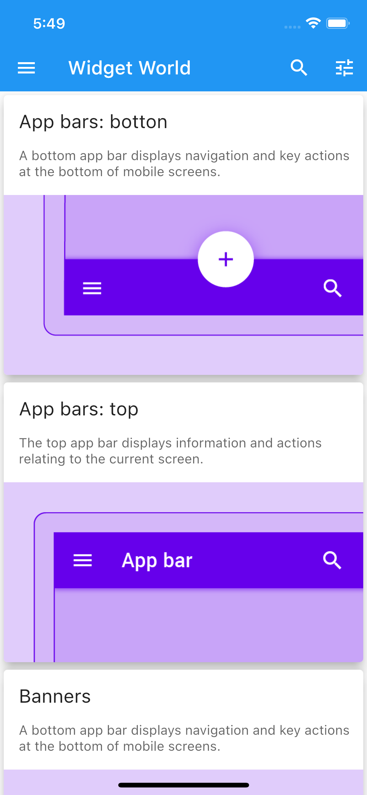
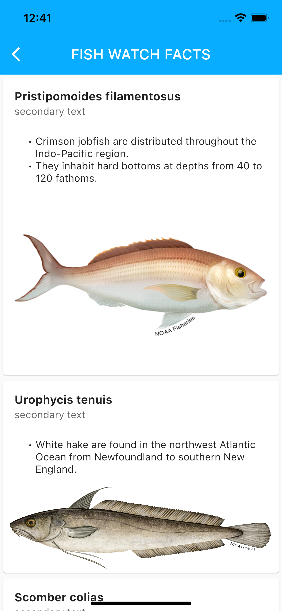

# widgets_flutter

Welcome to Widgets World. Here you will find all of widgets that i've learned.

## New zone

In this section I will consume public API's to show different ways of displaying this data. For example, here the firts example:

### Fish App

#### Api: https://www.fishwatch.gov/profiles/acadian-redfish

## Getting Started

This project is a starting point for a Flutter application.

A few resources to get you started if this is your first Flutter project:

- [Lab: Write your first Flutter app](https://docs.flutter.dev/get-started/codelab)
- [Cookbook: Useful Flutter samples](https://docs.flutter.dev/cookbook)

For help getting started with Flutter development, view the
[online documentation](https://docs.flutter.dev/), which offers tutorials,
samples, guidance on mobile development, and a full API reference.
